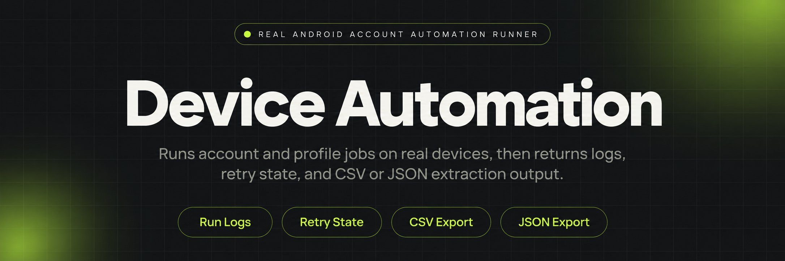
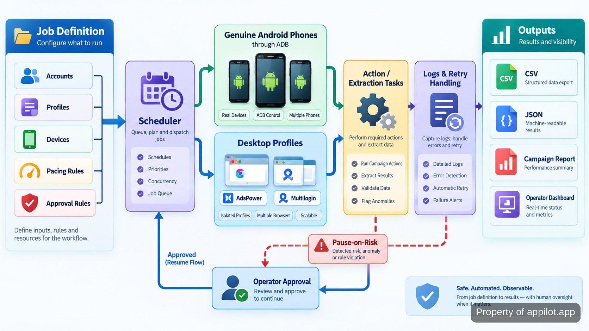

<p align="center">
  <a href="https://www.appilot.app" target="_blank" rel="nofollow">
    
  </a>
</p>

## beta kw

**beta kw** is the operator-facing automation tool I run when account, profile, and device work is too repetitive to handle one screen at a time. It schedules actions on genuine Android phones, routes desktop-profile jobs through isolated browser profiles, runs mobile-app extraction, supports engagement and warmup flows, and records failures instead of letting them disappear into a queue.

The useful boundary is simple: the tool controls execution, pacing, retries, approvals, and output handling; it does not decide whether a platform will flag or ban an account. On the Android lane it uses physical devices rather than emulators. On the desktop lane it can work with <a href="https://help.adspower.com/docs/api" target="_blank" rel="nofollow">AdsPower Local API</a> and <a href="https://multilogin.com/help/en_US/api" target="_blank" rel="nofollow">Multilogin automation</a> for profile-level tasks. Extraction jobs can write structured CSV or JSON, while operator runs keep logs and retry state for review.

This repository is for people who already think in accounts, profiles, devices, warmup, and per-account limits. The main question is whether a run can be governed, inspected, paused, and handed to another operator without guesswork.

<a href="https://www.appilot.app" target="_blank" rel="nofollow">
  
</a>

<p align="center">
  <a href="https://t.me/Bitbash333" target="_blank" rel="nofollow">
    
  </a>&nbsp;
  <a href="https://wa.me/923249868488?text=Hi%2C%20I%27m%20interested." target="_blank" rel="nofollow">
    
  </a>&nbsp;
  <a href="mailto:hello@appilot.app" target="_blank" rel="nofollow">
    
  </a>&nbsp;
  <a href="https://www.appilot.app" target="_blank" rel="nofollow">
    
  </a>
</p>

## How the run moves from input to output

A run starts with a job definition: target accounts or profiles, the action to perform, timing rules, and any approval requirement. The scheduler validates that definition, resolves the assigned device or desktop profile, then applies pacing before work is dispatched. Android work is sent to a real handset through <a href="https://developer.android.com/tools/adb" target="_blank" rel="nofollow">Android Debug Bridge</a>, the command-line interface used to communicate with attached Android devices. Desktop work is routed to the selected profile manager instead.

During execution, each task writes a status entry. A recoverable failure goes through the retry path; a risk condition can pause the account rather than pushing the next action blindly. High-risk actions can stop at an approval gate until an operator releases them. Extraction runs normalize requested fields before export, so the output is shaped consistently rather than copied as raw app text.

The pipeline has four practical checkpoints: validate, route, execute, review. That separation matters when a run happens overnight because a morning operator can tell whether a job never started, reached a device, retried, paused, or completed.



## Core Features

| Feature | Description |
| --- | --- |
| Physical Android device execution | Emulator-specific behavior is removed from the Android path by running jobs on genuine phones, with device assignment visible for long-term account pairing. |
| Scheduled account actions | Manual repetition is replaced by queued outreach, engagement, posting, or warmup actions with pacing and rate limits applied before dispatch. |
| Desktop profile routing | Profile work goes through AdsPower or Multilogin instead of manual session launches, with profile-group routing and centralized failure logs. |
| Mobile app data extraction | Copying fields from app screens is replaced by structured extraction, field mapping, normalization, and CSV or JSON export. |
| Retries and live run logs | Silent failures become visible through logged status, retry handling, and failure alerts that show what needs attention. |
| Approval and pause controls | Risky actions can stop at approval gates or pause-on-risk rules before more work is sent. |

The two output formats are deliberately ordinary. <a href="https://www.rfc-editor.org/rfc/rfc4180" target="_blank" rel="nofollow">RFC 4180</a> documents the common CSV format, while <a href="https://www.rfc-editor.org/rfc/rfc8259" target="_blank" rel="nofollow">RFC 8259</a> defines JSON for structured data interchange. That makes extraction output easy to inspect or pass into a warehouse process without inventing a private format.

## Operator Controls and Failure Handling

The control surface is built around failures that matter in multi-account work: an unavailable device, a profile that cannot start, a task that errors after launch, or an account that needs to stop. Each job keeps the account or profile, assigned device, action, attempt state, and last result. Retries handle operational failures; they are not permission to repeat an account action indefinitely.

Warmup and engagement runs use pacing rules rather than a single fastest-possible queue. A rate limit here means a configured cap on how often an action is allowed to run for an account or task group. When a risk rule fires, the safer path is pause and review. The repository does not describe any setting as undetectable, ban-proof, or guaranteed to satisfy a platform's terms.

For desktop profiles, the vendor API references define profile operations and authentication. Credentials belong in local environment configuration, not committed job files or screenshots.

<a href="https://tally.so/r/yP5oDx?platform=GitHub&amp;format=Product+repo&amp;brand=Appilot&amp;niche=appilot&amp;page=Beta+Kw+on+Real+Android+Devices&amp;date=2026-09-14" target="_blank" rel="nofollow">
  
</a>

## Tech Stack

The repository uses a small <a href="https://docs.python.org/3/" target="_blank" rel="nofollow">Python</a> command-line runner as the operator entry point, with separate adapters for Android devices and desktop profile managers. Python fits the job because scheduling, API calls, data shaping, and file export can live in one readable process without requiring a browser UI for every run. The Android adapter calls ADB against attached physical devices; there is no emulator execution path in the normal Android workflow.

Desktop adapters isolate the API-specific parts of AdsPower and Multilogin from the rest of the scheduler. The core runner only needs a profile identifier, task definition, and result; starting or closing a profile stays inside the relevant adapter. Export code writes CSV and JSON from the same normalized record shape, which avoids two separate extraction pipelines.

Operations are file-based and explicit: job definitions live under `config/`, logs under `logs/`, exported datasets under `output/`, and runbooks under `runbooks/`. Android's <a href="https://source.android.com/docs/security/overview/reports" target="_blank" rel="nofollow">security reports</a> are useful background when reviewing device-management practices.

## Directory Structure

The file layout keeps operator configuration away from platform adapters. That matters when a desktop API changes or a phone drops offline: the change stays in one module instead of leaking into every job definition. Runbooks sit beside the code because account hygiene, device pairing, restart steps, and approval rules are part of operating the system, not tribal knowledge. The example job file is safe to copy because credentials are kept outside it.

```text
automation-runner/
├── runner/
│   ├── cli.py
│   ├── scheduler.py
│   ├── devices/
│   │   └── android.py
│   ├── profiles/
│   │   ├── adspower.py
│   │   └── multilogin.py
│   ├── policies/
│   │   ├── pacing.py
│   │   └── approval.py
│   ├── extract/
│   │   ├── normalize.py
│   │   └── exporters.py
│   └── ops/
│       ├── retries.py
│       └── logging.py
├── config/
│   └── jobs.example.json
├── runbooks/
│   ├── operations.md
│   └── account-hygiene.md
├── tests/
│   ├── test_pacing.py
│   └── test_exports.py
├── requirements.txt
└── README.md
```

The most important boundary is `policies/`: pacing, approval, and pause behavior can be reviewed without reading device-control code. `extract/` owns field normalization and export, while `ops/` owns retries and logs. Tests cover pacing and export behavior, the parts most likely to create quiet operational errors. Troubleshooting starts by identifying the failed stage, then reading the module and log entry responsible for that stage. That keeps a one-off provider fix from changing scheduling, policy, or export behavior elsewhere in the project.

## Performance Benchmarks

This page does not publish throughput, uptime, or success-rate figures because no measured benchmark is attached to the repository. Those numbers would be misleading without the device mix, action type, network conditions, account state, and pacing policy used for the test. The hard implementation fact is simpler: the Android lane uses zero emulators.

The runner measures performance per job: start time, finish time, status, retries, pause reason, target ID, and output rows. A useful benchmark repeats the production task with the same pacing, then compares completions with retries and pauses. <a href="https://radar.cloudflare.com/year-in-review/2025" target="_blank" rel="nofollow">Cloudflare Radar's 2025 Year in Review</a> is useful context on bot-traffic patterns, not a benchmark for this repository.

| Measure | What it tells an operator |
| --- | --- |
| Elapsed time | Whether the same task is slowing down on a device or profile group. |
| Retry count | Whether operational failures are recurring instead of resolving on the first attempt. |
| Paused jobs | Which accounts or tasks stopped because a risk or approval rule intervened. |
| Output rows | Whether an extraction run produced the expected amount of structured data. |

## How to Run Account Automation Using beta kw

- **STEP 1 — Download & Set Up the Project**  
Download, set up, and install **beta kw** to get the project running. Clone this repository, create the environment, and install the listed requirements.
- **STEP 2 — Check Targets**  
Run `python -m runner devices` and review the available Android devices or desktop profile targets before loading a job definition.
- **STEP 3 — Validate the Job**  
Set account or profile IDs, action type, pacing, schedule, approval requirement, and extraction fields in `config/jobs.json`, then run the validator.
- **STEP 4 — Run and Review**  
Execute the job with the CLI. Review `logs/` for status and retries, then collect structured extraction files from `output/` when applicable.

```bash
python -m venv .venv
source .venv/bin/activate
pip install -r requirements.txt
python -m runner devices
python -m runner validate config/jobs.json
python -m runner run config/jobs.json
```

The setup path is intentionally narrow: establish the local environment, confirm the targets, validate configuration, then run. If validation fails, fix the job file before dispatching anything to a phone or profile. A clean validation step is cheaper than discovering a bad identifier or missing approval rule halfway through an overnight batch.

## Use Cases

- Run staged warmup across paired accounts and real Android devices, using pacing and pause rules so risk can be reviewed before volume increases.
- Schedule outreach, engagement, or posting across many accounts while keeping per-account routing, logs, retries, and approval gates visible.
- Extract mobile-app fields on genuine Android hardware, normalize the records, and export CSV or JSON for analysis or warehouse loading.
- Route desktop tasks to grouped AdsPower or Multilogin profiles, then inspect centralized logs instead of opening each profile manually.

The common pattern is not “run everything faster.” It is “make repeated work inspectable.” An agency operator can hand over the runbook, job file, and logs to the next shift without losing routing or controls. A growth operator can separate warmup from later campaigns instead of treating every account as identical.

The system works best when inputs and actions are repeatable. It is less useful when every account needs a different judgment call. Approval gates mark that boundary: automate the mechanical path, stop where a person should decide, and keep a record of what ran.

## FAQ

### Does the Android side use emulators?

No. The Android execution path is designed around genuine Android hardware, with device communication handled through ADB. The repository does not use an emulator lane as a substitute for the physical-device workflow.

### What happens when a run fails or an account is flagged?

Operational failures are logged and can enter the retry path; risk conditions can pause work for review. High-risk actions can also require operator approval. None of those controls guarantees that a platform will not flag or ban an account.

### What does an extraction job write out?

Extraction jobs normalize the requested fields and can write structured CSV or JSON. The output belongs under `output/`, while run status, retries, and failure detail stay in the logs so data and operations are easy to inspect separately.

<table>
  <tr>
    <td align="center" width="33%">
      
      <p>This scraper helped me gather thousands of posts effortlessly. The setup was fast, and exports are super clean and well-structured.</p>
      <p><b>Nathan Pennington</b><br>Marketer<br>★★★★★</p>
    </td>
    <td align="center" width="33%">
      
      <p>What impressed me most was how accurate the extracted data is. Likes, comments, timestamps — everything aligns perfectly.</p>
      <p><b>Greg Jeffries</b><br>SEO Affiliate Expert<br>★★★★★</p>
    </td>
    <td align="center" width="33%">
      
      <p>It's by far the best tool I've used. Ideal for trend tracking, competitor monitoring, and influencer insights.</p>
      <p><b>Karan</b><br>Digital Strategist<br>★★★★★</p>
    </td>
  </tr>
</table>